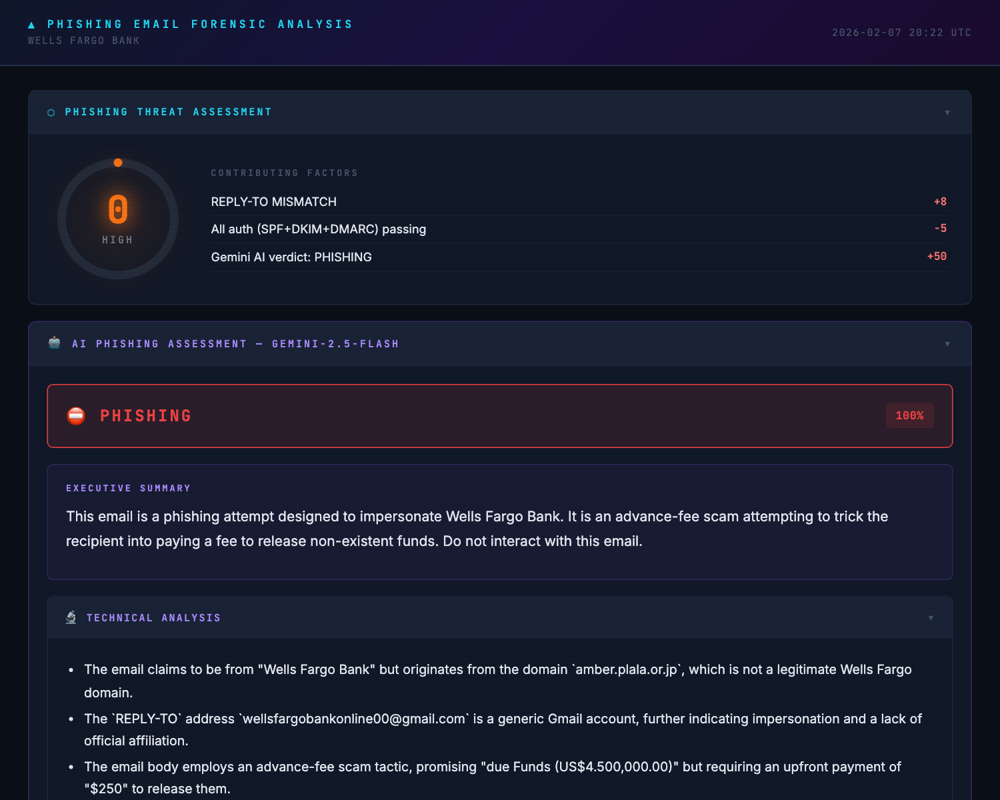

# 🛡️ PEFA — Phishing Email Forensic Analyzer

[](https://pypi.org/project/pefa/)
[](https://pypi.org/project/pefa/)

A Python CLI tool that converts `.eml` files into cyber-infographic PNGs and interactive HTML reports. PEFA performs automated forensic analysis of phishing indicators and produces a composite threat score (0–100) backed by multiple detection engines and optional threat intelligence APIs.

<div align="center">
<a href="examples/WELLS%20FARGO%20BANK.png">

</a>
<p><em>☝️ Click to see full report · 🔗 <a href="examples/WELLS%20FARGO%20BANK.html">Interactive HTML version</a> · <a href="examples/">All sample reports</a></em></p>
</div>

<details>
<summary>📂 More sample reports (17 total)</summary>

| Report | PNG | HTML |
|---|---|---|
| ATTENTION DEAR | [🖼️ PNG](examples/ATTENTION%20DEAR.png) | [🌐 HTML](examples/ATTENTION%20DEAR.html) |
| Congratulations Dear | [🖼️ PNG](examples/Congratulations%20Dear.png) | [🌐 HTML](examples/Congratulations%20Dear.html) |
| Dear Friend | [🖼️ PNG](examples/Dear%20Friend.png) | [🌐 HTML](examples/Dear%20Friend.html) |
| Dear Winner | [🖼️ PNG](examples/Dear%20Winner_.png) | [🌐 HTML](examples/Dear%20Winner_.html) |
| File | [🖼️ PNG](examples/File.png) | [🌐 HTML](examples/File.html) |
| Greetings to you | [🖼️ PNG](examples/Greetings%20to%20you%2C.png) | [🌐 HTML](examples/Greetings%20to%20you%2C.html) |
| HAPPY NEW YEAR! | [🖼️ PNG](examples/HAPPY%20NEW%20YEAR!.png) | [🌐 HTML](examples/HAPPY%20NEW%20YEAR!.html) |
| Konto-Überprüefig (Swiss German) | [🖼️ PNG](examples/Ihri%20Mithilf%20isch%20gfrogt_%20Konto-%C3%9Cberpr%C3%BCefig%20offen%20Ref-E5W13XO1LE18GS1679.png) | [🌐 HTML](examples/Ihri%20Mithilf%20isch%20gfrogt_%20Konto-%C3%9Cberpr%C3%BCefig%20offen%20Ref-E5W13XO1LE18GS1679.html) |
| Online Bank Of Africa | [🖼️ PNG](examples/Online%20Bank%20Of%20Africa.png) | [🌐 HTML](examples/Online%20Bank%20Of%20Africa.html) |
| Please I Need Your Urgent Attention | [🖼️ PNG](examples/Please%20I%20Need%20Your%20Urgent%20Attention.%20This%20Is%20Mark%20Gelkirchen..png) | [🌐 HTML](examples/Please%20I%20Need%20Your%20Urgent%20Attention.%20This%20Is%20Mark%20Gelkirchen..html) |
| INSTRUCTION TO CREDIT YOUR ACCOUNT ($25M) | [🖼️ PNG](examples/REF_-%20INSTRUCTION%20TO%20CREDIT%20YOUR%20ACCOUNT%20WITH%20THE%20SUM%20OF%20(US%2425Million).png) | [🌐 HTML](examples/REF_-%20INSTRUCTION%20TO%20CREDIT%20YOUR%20ACCOUNT%20WITH%20THE%20SUM%20OF%20(US%2425Million).html) |
| THIS IS YOUR ATM VISA CARD | [🖼️ PNG](examples/THIS%20IS%20YOUR%20ATM%20VISA%20CARD..png) | [🌐 HTML](examples/THIS%20IS%20YOUR%20ATM%20VISA%20CARD..html) |
| Text or Call +1 225 463 0148 | [🖼️ PNG](examples/Text%20or%20Call%20%2B1%20225%20463%200148.png) | [🌐 HTML](examples/Text%20or%20Call%20%2B1%20225%20463%200148.html) |
| URGENT RESPONSE | [🖼️ PNG](examples/URGENT%20RESPONSE.png) | [🌐 HTML](examples/URGENT%20RESPONSE.html) |
| Votre colis est prêt pour la livraison | [🖼️ PNG](examples/Votre%20colis%20est%20pr%C3%AAt%20pour%20la%20livraison.png) | [🌐 HTML](examples/Votre%20colis%20est%20pr%C3%AAt%20pour%20la%20livraison.html) |
| Your Funds Update! | [🖼️ PNG](examples/Your%20Funds%20Update!.png) | [🌐 HTML](examples/Your%20Funds%20Update!.html) |
| original_msg | [🖼️ PNG](examples/original_msg.png) | [🌐 HTML](examples/original_msg.html) |

</details>

---

## ✨ Features

- 🎯 **Threat Scoring** — Weighted 0–100 composite score across 7 categories with 5 severity levels (Clean / Low / Medium / High / Critical)
- 🔗 **Link Analysis** — HREF mismatches, brand lookalikes, homoglyph domains, IP-based URLs, URL shorteners, suspicious TLDs, JavaScript/data URIs
- 👤 **Sender Spoofing Detection** — Display name spoofing, Return-Path/Reply-To mismatches, domain impersonation, homoglyph characters
- ⚡ **Urgency Language Scanning** — 24 social-engineering pressure patterns, generic greeting detection, keyword density scoring
- 📎 **Attachment Threat Assessment** — 40+ dangerous extensions, macro-enabled documents, double extensions, MIME mismatches, file hashing (MD5/SHA256)
- 🔐 **Authentication Checks** — SPF, DKIM, and DMARC validation from headers (with optional MXToolbox deep validation)
- 🛤️ **Delivery Path Tracing** — Full email hop trace with IP geolocation per relay
- 📅 **Domain Age Lookup** — WHOIS-based registration date and age risk assessment
- 🔤 **Language Quality Analysis** — Mixed-script detection, entropy analysis, zero-width characters, irregular spacing
- 🧬 **IOC Extraction** — Consolidated Indicators of Compromise (IPs, domains, URLs, emails, hashes) with optional enrichment
- 🤖 **AI Assessment** — Optional Google Gemini analysis with verdict, confidence score, attack classification, and recommended actions
- 📊 **Interactive HTML Reports** — Collapsible sections, scroll-spy navigation, copy-to-clipboard, animated threat gauge, tooltips
- 📁 **Batch Processing** — Analyze entire directories of `.eml` files with a single command
- 🌐 **Web UI** — Browser-based upload interface with live analysis (no Playwright needed client-side)

## 📦 Installation

```bash
pip install pefa
playwright install chromium
```

Or install from source:

```bash
pip install .
playwright install chromium
```

> Requires Python 3.10+ · [PyPI page](https://pypi.org/project/pefa/)

## 🚀 Quick Start

```bash
# Analyze a single email → PNG infographic
pefa input.eml

# Also generate an interactive HTML report
pefa input.eml --html

# Include Gemini AI assessment
pefa input.eml --gemini

# Skip all external API calls (fully offline)
pefa input.eml --no-api

# Batch process a directory
pefa ./emails/ -o ./reports/

# Launch the web UI
pefa --web --port 8080
```

Or run as a module:

```bash
python3 -m pefa input.eml
```

## 📖 Usage Examples

### Analyze a single email

```bash
pefa suspicious-email.eml
```

This produces `suspicious-email.png` in the current directory — a full-page infographic with threat score, sender analysis, link flags, authentication results, and the rendered email body.

### Generate both PNG and interactive HTML

```bash
pefa suspicious-email.eml --html
```

Outputs two files: `suspicious-email.png` and `suspicious-email.html`. The HTML report includes collapsible sections, scroll-spy navigation, an animated threat gauge, copy-to-clipboard for IOCs, and print/download buttons.

### Save output to a specific location

```bash
pefa suspicious-email.eml -o ./reports/case-42.png
pefa suspicious-email.eml -o ./reports/case-42.png --html
```

The `-o` flag sets the output path. When combined with `--html`, the HTML file is placed alongside the PNG.

### Batch process a folder of emails

```bash
pefa ./inbox/ -o ./reports/
```

Analyzes every `.eml` file in `./inbox/` and writes reports to `./reports/`. A single Playwright browser instance is reused across all files for faster processing. If `-o` is omitted, reports go to `./inbox/reports/`.

### Include AI-powered assessment

```bash
export GEMINI_API_KEY="your-key-here"
pefa suspicious-email.eml --gemini
```

Adds a Gemini AI section to the report with a verdict (phishing/legitimate/suspicious), confidence score, attack type classification, and recommended actions. The AI assessment can also influence the overall threat score (+25 or +50 points).

To use a different Gemini model:

```bash
pefa suspicious-email.eml --gemini --gemini-model gemini-2.5-pro
```

### Run fully offline (no API calls)

```bash
pefa suspicious-email.eml --no-api
```

Skips all external lookups (IP geolocation, WHOIS, urlscan, VirusTotal, AbuseIPDB, AlienVault, MXToolbox). The analysis still runs SPF/DKIM/DMARC checks from headers, link analysis, urgency detection, and attachment scanning — all locally.

### Customize image dimensions

```bash
pefa suspicious-email.eml --width 1400 --scale 2
```

`--width` sets the viewport width in pixels (default: 1000). `--scale` sets the device scale factor (default: 1.5) — higher values produce sharper images at larger file sizes.

### Launch the web UI

```bash
pefa --web
```

Opens a browser-based drag-and-drop interface at `http://localhost:8080`. Upload `.eml` files and view interactive HTML reports directly — no Playwright needed on the client side.

```bash
pefa --web --port 9090
pefa --web --no-api
pefa --web --gemini
```

The web UI respects `--no-api` and `--gemini` flags.

### Combine multiple flags

```bash
# Full analysis with AI, HTML output, and high-res image
pefa suspicious-email.eml --html --gemini --width 1200 --scale 2

# Batch process offline with HTML reports
pefa ./inbox/ -o ./reports/ --html --no-api

# Run the sample emails included in the repo
pefa samples/ -o examples/ --html
```

### Use with threat intel API keys

Set any combination of API keys to enrich reports with external intelligence:

```bash
export GEMINI_API_KEY="..."       # AI assessment
export URLSCAN_API_KEY="..."      # Domain reputation
export VT_API_KEY="..."           # VirusTotal IOC reputation
export ABUSEIPDB_API_KEY="..."    # IP abuse reports
export OTX_API_KEY="..."          # AlienVault OTX threat intel
export MXTOOLBOX_API_KEY="..."    # Deep email auth validation

pefa suspicious-email.eml --html --gemini
```

Each integration activates independently — you don't need all keys. Missing keys are silently skipped.

## ⚙️ CLI Reference

```
usage: pefa [-h] [--web] [--port PORT] [-o OUTPUT] [--width WIDTH]
            [--scale SCALE] [--html] [--gemini]
            [--gemini-model MODEL] [--no-api]
            [input]

positional arguments:
  input                 .eml file or directory of .eml files

options:
  -o, --output          Output path for generated reports
  --web                 Start browser-based web UI
  --port                Web server port (default: 8080)
  --width               Viewport width in pixels (default: 1000)
  --scale               Device scale factor (default: 1.5)
  --html                Emit interactive HTML report alongside PNG
  --gemini              Include Gemini AI assessment
  --gemini-model        Gemini model to use (default: gemini-2.5-flash)
  --no-api              Skip all external API lookups
```

## 🎯 Threat Scoring

PEFA calculates a composite threat score from 0 to 100 using weighted categories:

| Category | Max Points | What It Measures |
|---|---|---|
| 🔐 Authentication | 20 | SPF, DKIM, DMARC failures |
| 👤 Sender | 20 | Spoofing, homoglyphs, header mismatches |
| 🔗 Links | 25 | HREF mismatches, brand lookalikes, IP URLs, shorteners |
| ⚡ Urgency | 15 | Pressure language patterns, generic greetings |
| 📎 Attachments | 10 | Dangerous extensions, macros, double extensions |
| 🔤 Language | 5 | Mixed scripts, entropy anomalies, quality issues |
| 📅 Domain Age | 10 | Newly registered or young domains |

Passing all authentication checks and having an established domain (3+ years) applies negative scoring. Gemini AI verdicts can add up to +50 additional points.

**Threat Levels:**

| Level | Score |
|---|---|
| 🔴 Critical | 70–100 |
| 🟠 High | 45–69 |
| 🟡 Medium | 25–44 |
| 🟢 Low | 10–24 |
| ⚪ Clean | 0–9 |

## 🔌 API Integrations

All API integrations are optional. PEFA works fully offline with `--no-api`. Each integration checks for its own environment variable and silently skips if unavailable. No API key is required to run a basic analysis — PEFA performs link analysis, urgency detection, sender spoofing checks, attachment scanning, authentication header parsing, and threat scoring entirely locally.

### Overview

| Service | Environment Variable | Free? | What It Adds to Reports |
|---|---|---|---|
| 🤖 [Google Gemini](#google-gemini) | `GEMINI_API_KEY` | Free tier available | AI verdict, attack classification, recommended actions |
| 🔍 [urlscan.io](#urlscanio) | `URLSCAN_API_KEY` | Free tier available | URL/domain reputation verdicts |
| 📧 [MXToolbox](#mxtoolbox) | `MXTOOLBOX_API_KEY` | Paid | Deep SPF/DKIM/DMARC validation against live DNS |
| 🦠 [VirusTotal](#virustotal) | `VT_API_KEY` | Free tier available | IOC reputation (IPs, domains, URLs, file hashes) |
| 🚨 [AbuseIPDB](#abuseipdb) | `ABUSEIPDB_API_KEY` | Free tier available | IP abuse confidence scores and report counts |
| 👽 [AlienVault OTX](#alienvault-otx) | `OTX_API_KEY` | Free | Threat intelligence pulse counts and reputation |
| 🌍 ip-api.com | *(none)* | Free | IP geolocation for delivery path hops |
| 📋 WHOIS | *(none)* | Free | Domain registration age and registrar info |

### Getting API Keys

#### Google Gemini

Sign up at [Google AI Studio](https://ai.google.dev/) to get a free API key. The free tier provides generous rate limits suitable for individual use.

```bash
export GEMINI_API_KEY="your-key-here"
```

Gemini provides an AI-powered phishing assessment that includes a verdict (phishing / suspicious / legitimate), confidence percentage, executive summary, technical analysis, attack type classification, and recommended actions. It can also boost the threat score by up to +50 points.

```bash
# Use default model (gemini-2.5-flash)
pefa email.eml --gemini

# Use a more capable model
pefa email.eml --gemini --gemini-model gemini-2.5-pro
```

> **Note:** The `--gemini` flag is required to activate AI analysis even if `GEMINI_API_KEY` is set. This keeps AI calls explicit.

#### urlscan.io

Sign up at [urlscan.io](https://urlscan.io/user/signup/) for a free account. Navigate to your profile to find your API key.

```bash
export URLSCAN_API_KEY="your-key-here"
```

When suspicious links are detected, PEFA queries urlscan.io for domain reputation data including overall verdict (malicious/suspicious/benign), page metadata, and redirect statistics. Results link directly to the urlscan.io result page for manual investigation.

#### MXToolbox

Sign up at [MXToolbox](https://mxtoolbox.com/User/Register.aspx) for an API subscription.

```bash
export MXTOOLBOX_API_KEY="your-key-here"
```

Performs live DNS-based validation of SPF, DKIM, and DMARC records for the sender's domain. This goes beyond parsing email headers — it checks the actual DNS configuration. If MXToolbox results contradict the header claims (e.g., headers say DKIM pass but DNS shows a failure), PEFA flags the discrepancy as a warning.

#### VirusTotal

Sign up at [VirusTotal](https://www.virustotal.com/gui/join-us) for a free community account. Your API key is available on your profile page.

```bash
export VT_API_KEY="your-key-here"
```

Enriches extracted IOCs with multi-vendor detection results:
- **IPs** (up to 5) — malicious/suspicious/harmless detection counts and reputation score
- **Domains** (up to 5) — same detection breakdown plus reputation
- **URLs** (up to 3) — vendor detection counts
- **File hashes** (up to 5) — detection counts and meaningful filenames

> **Free tier:** 4 requests/minute, 500 requests/day, 15.5K requests/month.

#### AbuseIPDB

Sign up at [AbuseIPDB](https://www.abuseipdb.com/register) for a free account.

```bash
export ABUSEIPDB_API_KEY="your-key-here"
```

Checks IP addresses (up to 5) against AbuseIPDB's crowd-sourced abuse report database. Returns an abuse confidence score (0–100), total number of reports, whitelist status, country, and ISP. Queries cover reports from the last 90 days.

> **Free tier:** 1,000 checks/day.

#### AlienVault OTX

Sign up at [AlienVault OTX](https://otx.alienvault.com/accounts/signup/) for a free account.

```bash
export OTX_API_KEY="your-key-here"
```

Queries the Open Threat Exchange for community-sourced threat intelligence. Returns pulse counts (how many threat intelligence reports reference the IOC) and reputation scores for:
- IPs (up to 5)
- Domains (up to 5)
- URLs (up to 3)
- File hashes (up to 5)

### Setting Up All API Keys

For maximum enrichment, configure all keys in your shell profile (`~/.bashrc`, `~/.zshrc`, etc.):

```bash
# Required: set --gemini flag to activate
export GEMINI_API_KEY="your-gemini-key"

# Threat intelligence (activate automatically when set)
export URLSCAN_API_KEY="your-urlscan-key"
export VT_API_KEY="your-virustotal-key"
export ABUSEIPDB_API_KEY="your-abuseipdb-key"
export OTX_API_KEY="your-alienvault-key"

# Email authentication
export MXTOOLBOX_API_KEY="your-mxtoolbox-key"
```

Then run with full enrichment:

```bash
pefa email.eml --html --gemini
```

### API Usage Examples

```bash
# Fully offline — no API calls at all
pefa email.eml --no-api

# Basic analysis with free APIs only (ip-api.com + WHOIS)
# No env vars needed
pefa email.eml

# Add AI assessment only
export GEMINI_API_KEY="..."
pefa email.eml --gemini

# IOC enrichment with VirusTotal + AbuseIPDB
export VT_API_KEY="..."
export ABUSEIPDB_API_KEY="..."
pefa email.eml --html

# Full enrichment: all APIs + AI + HTML report
export GEMINI_API_KEY="..."
export VT_API_KEY="..."
export ABUSEIPDB_API_KEY="..."
export OTX_API_KEY="..."
export URLSCAN_API_KEY="..."
export MXTOOLBOX_API_KEY="..."
pefa email.eml --html --gemini

# Batch process with full enrichment
pefa ./emails/ -o ./reports/ --html --gemini
```

### How APIs Affect the Report

Without any API keys, PEFA still performs:
- Header-based SPF/DKIM/DMARC checks
- Link analysis (mismatches, brand impersonation, homoglyphs, suspicious TLDs)
- Sender spoofing detection
- Urgency language scanning
- Attachment threat assessment
- Language quality analysis
- Threat scoring (0–100)

Adding API keys progressively enriches the report:

| APIs Configured | Additional Report Sections |
|---|---|
| *(none)* | Base analysis with all local checks |
| + `GEMINI_API_KEY` | AI Assessment panel with verdict, confidence, attack classification |
| + `VT_API_KEY` | IOC table with VirusTotal detection counts per indicator |
| + `ABUSEIPDB_API_KEY` | IP abuse confidence scores in IOC table |
| + `OTX_API_KEY` | Threat intelligence pulse counts in IOC table |
| + `URLSCAN_API_KEY` | URL reputation verdicts in link analysis section |
| + `MXTOOLBOX_API_KEY` | Deep DNS validation results in authentication section |

## 🏗️ Architecture

```
.eml file → parser.py → pipeline.run_analysis() → PageRenderer.build() → Playwright → .png/.html
```

```
pefa/
├── cli.py                  # CLI argument parsing and entry point
├── parser.py               # .eml parsing and header extraction
├── pipeline.py             # Analysis orchestrator
├── scoring.py              # Weighted threat score calculation
├── highlighting.py         # Email body highlighting (urgency keywords, suspicious links)
├── constants.py            # TLDs, shorteners, extensions, regex patterns, homoglyphs
├── deps.py                 # Centralized optional dependency imports
├── analyzers/
│   ├── links.py            # LinkAnalyzer — URL and domain analysis
│   ├── sender.py           # SenderAnalyzer — spoofing and impersonation
│   ├── urgency.py          # UrgencyAnalyzer — pressure language patterns
│   ├── attachments.py      # AttachmentAnalyzer — file threat assessment
│   ├── language.py         # LanguageAnalyzer — text quality and encoding
│   └── ioc_consolidator.py # IOC extraction and enrichment
├── api/
│   ├── ip_lookup.py        # IP geolocation (ip-api.com)
│   ├── gemini.py           # Google Gemini AI assessment
│   ├── urlscan.py          # urlscan.io domain reputation
│   ├── mxtoolbox.py        # SPF/DKIM/DMARC validation
│   ├── whois_client.py     # Domain WHOIS lookup
│   ├── virustotal.py       # VirusTotal IOC lookup
│   ├── abuseipdb.py        # AbuseIPDB IP reputation
│   └── alienvault.py       # AlienVault OTX intelligence
├── renderers/
│   ├── page.py             # Full HTML page assembly
│   └── widgets/            # 13 analysis section widgets
└── templates/
    ├── css/                # Dark theme, interactive styling
    └── js/                 # Section navigation, animations, interactivity
```

## 📤 Output

🖼️ **PNG mode** (default) produces a single infographic image containing all analysis sections: threat gauge, sender analysis, authentication status, link flags, urgency patterns, attachments, domain age, delivery path, IP geolocation, and the rendered email body in a sandboxed frame.

📊 **HTML mode** (`--html`) additionally produces an interactive report with collapsible sections, scroll-spy navigation, animated gauges, copy-to-clipboard for IOCs, and download/print buttons.

🌐 **Web UI** (`--web`) serves a browser-based interface for uploading `.eml` files and viewing analysis results interactively without needing Playwright installed on the client.

## 🧪 Sample Emails

The `samples/` directory contains example phishing emails (419 scams, social engineering, impersonation) for testing. Pre-generated reports are available in [`examples/`](examples/).

```bash
pefa samples/
```

## 📄 License

See [pyproject.toml](pyproject.toml) for package metadata.
